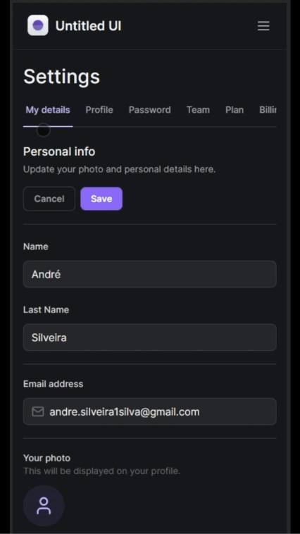

<h1 align="center">Untitled UI</h1>

 

 

## 🖥️ Project

This project has been developed as part of the Tailwind course from Rocketseat. To start project build, we have installed NextJs and as a part of this framework Tailwind is a default CSS.

Here is the link to [Untitled UI](https://tailwind-next-mu.vercel.app/). Note that some functions and tabs may not work, since this is a project to focus on Tailwind.

## 🎨 Layout

Here is the link to [Figma](https://www.figma.com/file/MU3H8HfTxX32ukt8ANpan7/Ignite-Tailwind?type=design&node-id=0-1&mode=design&t=eluvqil40n5E3AOh-0) layout.

## 📚 We have learned the following Tailwind concepts on this project.

- Tailwind fundamentals
- ESLint / Prettier config for Tailwind
- Theme First API
- Property extends
- Responsive layout - Tailwind classes are set to mobile first as default.
- Arbitrary value
- Class Group
- Animation
- System Theme

## 🛠️ The following frameworks that help with project build.

- Lucide
- Radix/ui
- Framer Motion
- Auto Animate
- Tailwind Variants - Slots API
- Tailwind Merge

## <h2 align="center"> 👋[Rocketseat](https://www.rocketseat.com.br/)</h2>
